# VisionLearn

> Accessible learning for children with Cortical Visual Impairment (CVI)

[](https://kotlinlang.org)
[](https://www.jetbrains.com/lp/compose-multiplatform/)
[]()
[](LICENSE)

## Table of Contents

- [Motivation and Background](#motivation-and-background)
- [Features](#features)
- [Screenshots](#screenshots)
- [Demo Video](#demo-video)
- [Technical Implementation](#technical-implementation)
- [How to Run](#how-to-run)
- [Project Structure](#project-structure)
- [The Perkins CVI Protocol](#the-perkins-cvi-protocol)
- [Future Steps](#future-steps)
- [License](#license)

## Motivation and Background

**VisionLearn** is a cross-platform mobile application (iOS & Android) designed to support accessible learning experiences for children with Cortical/Cerebral Visual Impairment (CVI).

### What is CVI?

Cortical Visual Impairment (CVI) is the leading cause of visual impairment in children in developed countries. Unlike ocular blindness, CVI affects how the brain processes visual information. Children with CVI often have normal eye exams but struggle with visual recognition, attention, and processing.

### The Problem

Parents, teachers, and therapists working with CVI children need specialized learning tools that:
- Adapt to individual visual profiles
- Follow evidence-based protocols like the Perkins CVI framework
- Provide high contrast, simplified visuals
- Offer audio feedback and accessibility features
- Track progress for IEP meetings

Existing apps don't address these specific needs, forcing educators to manually create materials. VisionLearn solves this by providing AI-powered, adaptive learning activities that follow the Perkins CVI Protocol.

## Features

### Visual Profile System
- Based on the **Perkins 16 Visual Behaviors** framework
- Customizable CVI phase selection (Phase I, II, III)
- Personalized color preferences (yellow, red, pink, blue, green, orange)
- Adjustable complexity and timing settings

### Five Learning Modules
1. **Image Recognition** - Identify objects with audio feedback and encouragement
2. **Cause & Effect** - Touch-response activities for engagement and learning
3. **Sorting** - Group objects by category with visual feedback
4. **Matching** - Find matching pairs with progressive difficulty
5. **Sequencing** - Arrange items in order (numbers, patterns, sizes)

### Accessibility First
- Large touch targets (minimum 64dp)
- High contrast CVI-friendly color options
- Screen reader support (TalkBack/VoiceOver)
- Audio feedback for all interactions
- Text-to-Speech for instructions and encouragement
- Configurable response timeouts
- Simple, uncluttered visual design

### AI-Powered Learning (Google Gemini)
- Dynamic question generation tailored to CVI needs
- Adaptive difficulty based on performance
- Personalized encouragement messages
- Fallback to local content when offline

### Custom Activity Creator
- Create personalized activities with your own images
- Take photos or select from gallery
- Configure question text and correct answers
- Share activities across sessions

### Progress Tracking
- Session history and statistics
- Accuracy tracking per module
- Total activities completed
- Visual progress dashboard

## Screenshots

### Onboarding Flow

| Welcome | Child's Name | CVI Phase | Color Selection |
|---------|--------------|-----------|-----------------|
| 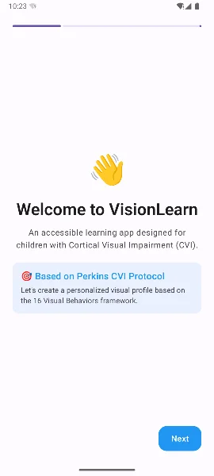 | 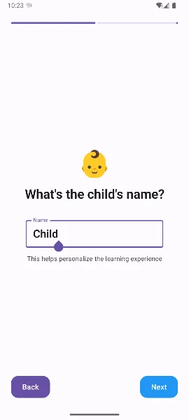 | 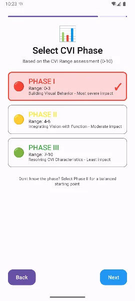 | 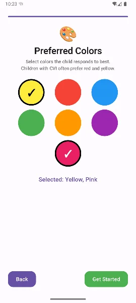 |

### Home & AI Generation

| Home Screen | AI Session Generation |
|-------------|----------------------|
| 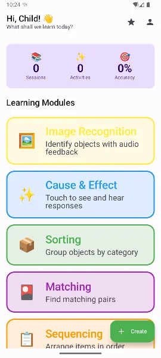 | 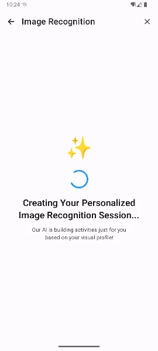 |

### Learning Modules

| Image Recognition | Cause & Effect | Sorting |
|-------------------|----------------|---------|
| 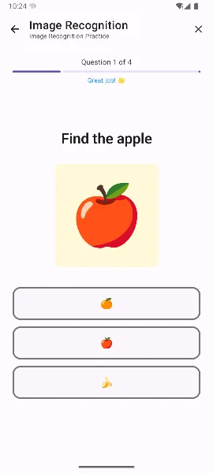 | 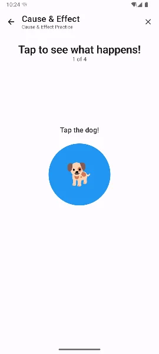 | 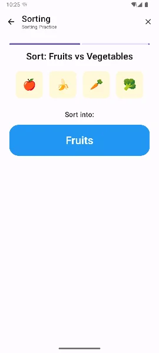 |

| Matching | Sequencing |
|----------|------------|
| 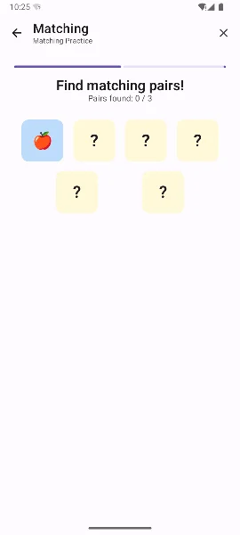 | 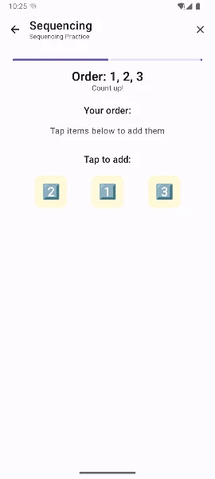 |

### Progress & Tools

| Progress Tracking | Content Creator | Visual Profile |
|-------------------|-----------------|----------------|
| 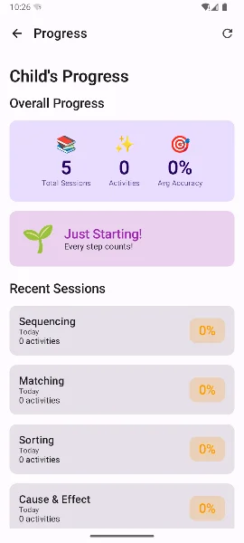 | 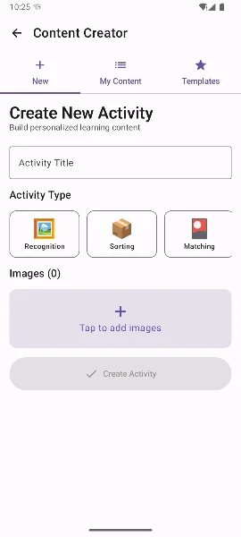 | 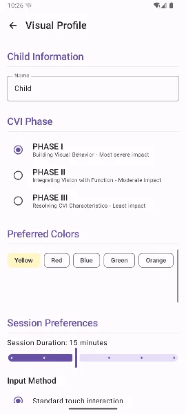 |

### iOS Version

| iOS AI Loading |
|----------------|
| 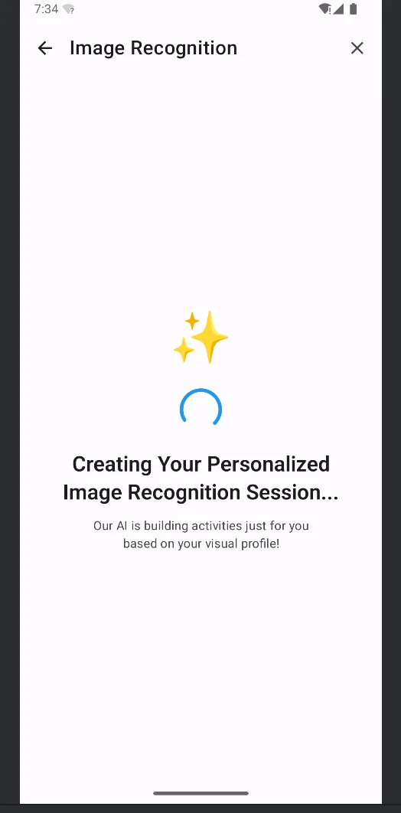 |

## Demo Video

[Watch Demo Video](https://youtube.com/shorts/ItFs8iionHk?feature=share)

## Technical Implementation

### Architecture

| Component | Technology |
|-----------|------------|
| **UI** | Compose Multiplatform 1.7.3 |
| **Language** | Kotlin 2.1.0 |
| **Architecture** | MVVM + Clean Architecture |
| **Navigation** | Voyager 1.1.0-beta02 |
| **Database** | SQLDelight 2.0.2 |
| **Networking** | Ktor 3.0.3 |
| **DI** | Koin 4.0.0 |
| **Image Loading** | Coil 3.0.4 |
| **AI** | Google Gemini API |

### Shared Code Structure

The app follows **Clean Architecture** principles with maximum code sharing:

- **Domain Layer** - Business models, repository interfaces
- **Data Layer** - Repository implementations, database, API clients
- **Presentation Layer** - ViewModels (ScreenModels), UI Components
- **AI Layer** - Gemini integration with local fallback

### Platform-Specific Code

| Feature | Android | iOS |
|---------|---------|-----|
| Database Driver | Android SQLite Driver | Native SQLite Driver |
| Text-to-Speech | Android TTS | AVSpeechSynthesizer |
| Image Picker | ActivityResultContracts | PHPickerViewController |
| Accessibility | TalkBack | VoiceOver |

### AI Integration

VisionLearn uses **Google Gemini API** for intelligent content generation:

- **GeminiSessionGenerator** - Creates dynamic, CVI-appropriate questions
- **LocalSessionGenerator** - Offline fallback with pre-defined content
- Automatic fallback when API is unavailable
- Timeout handling for responsive UX

## How to Run

### Prerequisites

- **Android Studio** Hedgehog (2023.1.1) or later
- **Xcode 15+** (for iOS)
- **JDK 17**
- **[KDoctor](https://github.com/Kotlin/kdoctor)** for environment verification

```bash
# Verify your environment
brew install kdoctor
kdoctor
```

### 1. Clone the Repository

```bash
git clone https://github.com/arulagarwal/VisionLearn.git
cd VisionLearn
```

### 2. Configure Gemini API Key (Optional but Recommended)

Get a free API key from [Google AI Studio](https://aistudio.google.com):

1. Create/open `local.properties` in the project root
2. Add your API key:

```properties
GEMINI_API_KEY=your_api_key_here
```

> **Note:** The app works without an API key using local fallback content, but AI-generated questions provide a better experience.

### 3. Build & Run

#### Android

```bash
# Build debug APK
./gradlew :composeApp:assembleDebug

# Install on connected device/emulator
./gradlew :composeApp:installDebug
```

Or open in Android Studio and run the `composeApp` configuration.

#### iOS

```bash
# First, build the Kotlin framework
./gradlew :composeApp:linkDebugFrameworkIosSimulatorArm64

# Open Xcode project
open iosApp/iosApp.xcodeproj
```

In Xcode:
1. Select an iPhone Simulator (iPhone 15 recommended)
2. Press **Cmd+R** to build and run

> **Note:** First iOS build takes 2-5 minutes to compile the Kotlin framework.

### Troubleshooting

| Issue | Solution |
|-------|----------|
| "No such module 'ComposeApp'" in Xcode | Run `./gradlew :composeApp:linkDebugFrameworkIosSimulatorArm64` first |
| Gradle build fails with Java error | Ensure `JAVA_HOME` points to JDK 17 |
| iOS linker errors for sqlite3 | Clean build in Xcode (Cmd+Shift+K) and rebuild |

## Project Structure

```
VisionLearn/
├── composeApp/
│   └── src/
│       ├── commonMain/              # Shared Kotlin code (95%+)
│       │   ├── kotlin/
│       │   │   ├── ai/              # AI services (Gemini + Local)
│       │   │   ├── data/            # Repositories, database
│       │   │   ├── di/              # Koin dependency injection
│       │   │   ├── domain/          # Models, interfaces
│       │   │   ├── platform/        # Expect declarations
│       │   │   └── presentation/    # Screens, components, themes
│       │   └── sqldelight/          # Database schema
│       ├── androidMain/             # Android implementations
│       │   └── kotlin/
│       │       ├── MainActivity.kt
│       │       ├── VisionLearnApplication.kt
│       │       └── platform/        # TTS, ImagePicker, etc.
│       └── iosMain/                 # iOS implementations
│           └── kotlin/
│               ├── MainViewController.kt
│               └── platform/        # TTS, ImagePicker, etc.
├── iosApp/                          # Xcode project
│   ├── iosApp/
│   │   ├── iOSApp.swift
│   │   ├── ContentView.swift
│   │   └── Info.plist
│   └── iosApp.xcodeproj/
├── gradle/
│   └── libs.versions.toml           # Version catalog
├── screenshots/                     # App screenshots
├── build.gradle.kts
├── settings.gradle.kts
└── local.properties                 # API keys (gitignored)
```

## The Perkins CVI Protocol

This app is designed around the **Perkins CVI Protocol**, a comprehensive educational assessment tool created by The CVI Center at Perkins School for the Blind. The protocol identifies **16 Visual Behaviors**:

1. Visual Attention
2. Visual Recognition  
3. Visual Curiosity
4. Object Complexity
5. Array Complexity
6. Sensory Complexity
7. Light Preference
8. Color Preference
9. Movement Need
10. Visual Latency
11. Visual Field Preference
12. Distance Viewing
13. Visual-Motor Integration
14. Visual Reflexes
15. Novelty Tolerance
16. Face Recognition

VisionLearn focuses on **Color Preference** and **Object/Array Complexity** - key factors that can be addressed through software adaptation.

Learn more: [Perkins CVI Protocol](https://www.perkins.org/our-work/cvi/the-perkins-cvi-protocol/)

## Future Steps

- [ ] **Additional Visual Behaviors** - Support more of the 16 behaviors
- [ ] **AI Image Simplification** - Automatically simplify complex images
- [ ] **Switch Access** - Full switch device support for motor impairments
- [ ] **Multi-language Support** - Localization for global accessibility
- [ ] **Cloud Sync** - Sync profiles and progress across devices
- [ ] **Therapist Dashboard** - Web portal for professionals
- [ ] **Export Reports** - Generate progress reports for IEP meetings

## License

This project is licensed under the Apache License 2.0 - see the [LICENSE](LICENSE) file for details.

## Acknowledgments

- [Perkins School for the Blind](https://www.perkins.org/) for the CVI Protocol framework
- [JetBrains](https://www.jetbrains.com/) for Kotlin Multiplatform
- [Google](https://ai.google.dev/) for Gemini AI

---

Created for the **KotlinConf 2026 Kotlin Multiplatform Contest**
